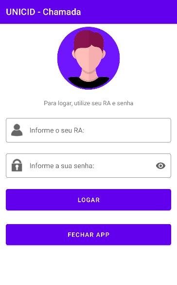
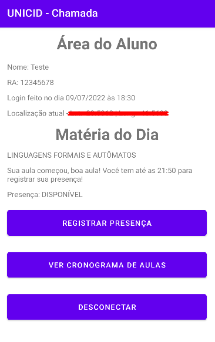

<h2 align="center">
  Sistema de chamada de sala
</h2>

 <a href="#-sobre-o-projeto">Sobre</a> •
 <a href="#-tecnologias">Tecnologias</a> •
 <a href="#-home">Home</a> • 
 <a href="#-Area-do-aluno">Area do Aluno</a> • 
 <a href="#-como-executar">Executar</a> 

## 💻 Sobre o projeto

É uma aplicação mobile que funciona como uma chamada de aula. A primeira activity é para fazer um login, aonde você coloca o seu RA e a sua senha. Após fazer o login
mostra os dados do aluno, como horário que fez login, nome, ra e a localização atual (lat e long). Com base nesses dados, ele vai ver se o aluno tem aula nesse dia. 
Caso tenha, se estiver dentro do horário da aula e na localização da sala, ele permite você registrar a presença, caso contrário aparece uma mensagem dizendo que
você hoje não tem aula ou algo do gênero. É possível também consultar as matérias que você tem na sua grade.

---

## 🛠 Tecnologias

As seguintes ferramentas foram usadas na construção do projeto:

-   **Android Studio**
-   **Kotlin**
-   **XML**

## 🚀 Home

  

## 🚀 Area do Aluno

  

---

## 🛠 COMO EXECUTAR

Basta baixar os arquivos e depois executar em no android studio, sendo a versão mais recente do android studio, e api 30 para cima.

